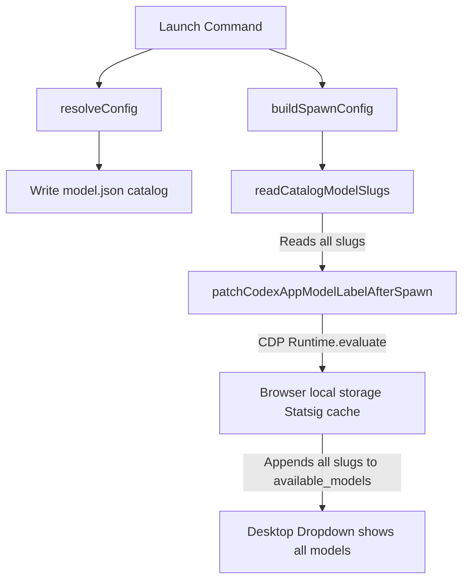

# Codex Desktop App Multi-Model Switcher Patch

This document describes the design and implementation of the patch enabling model switching in the Codex Desktop App (Electron build) when configured with custom models.

---

## 🎯 Background & The Challenge

In its default configuration, the Codex Desktop App filters available models through a Statsig dynamic configuration (ID `107580212`). Custom model identifiers (such as models loaded from OpenRouter) are not present in this hardcoded Statsig catalog, causing the UI to filter them out and fallback to rendering the generic label `"Custom"`.

To work around this, a launcher hook was implemented that:
1. Connects to the Codex Desktop window via a local Chrome DevTools Protocol (CDP) port.
2. Patches the browser's local storage Statsig evaluation cache to force-append custom models into the `available_models` list.
3. Reloads the interface to render the customized model labels using the format `{model_id} - {gateway_name}` (e.g., `openrouter/free - openrouter`).

Initially, this patch only allowed the *currently launched* model. Any other models present in the custom model catalog (`model.json`) were filtered out, preventing the user from switching models inside the active Desktop UI dropdown.

---

## 🛠️ The Multi-Model Switcher Solution

The launcher has been updated to fully support model switching. Instead of patching only the single launched model, we extract all custom catalog models and inject them together.

### Architecture



1. **Catalog Reading**: A new helper `readCatalogModelSlugs` reads and parses `model.json` in the active `CODEX_HOME` directory.
2. **Whole-Catalog Rewriter**: During configuration setup, the launcher loops through all models in `model.json` and updates their `display_name` to follow the `{model_id} - {gateway_name}` convention based on the active launch gateway. This ensures all historical entries in the catalog display correctly.
3. **Bulk Patching**: When the app starts, `patchCodexAppModelLabelAfterSpawn` receives the array of all catalog slugs.
4. **Local Storage Merger**: Inside the renderer evaluation context, the patch merges all catalog slugs into the Statsig configuration:
   ```javascript
   const availableModels = Array.isArray(config.value.available_models) ? config.value.available_models : [];
   config.value.available_models = Array.from(new Set([...availableModels, ...modelNames]));
   ```

---

## 📂 Key Files & Code Locations

- **[src/agents/codex-app.ts](file:///Users/workspaces/projects/falcon/src/agents/codex-app.ts)**:
  - Implements `readCatalogModelSlugs` to parse the JSON file.
  - Updates `buildSpawnConfig` to read all catalog slugs and forward them to the patch hook.
- **[src/agents/codex-app-statsig.ts](file:///Users/workspaces/projects/falcon/src/agents/codex-app-statsig.ts)**:
  - Updates patch functions to accept a string array `modelNames`.
  - Merges all model names into the allowed Statsig catalog in the browser context.
  - Implements the early-abort exit check in the polling loop.

---

## 🧪 Test Coverage & Safety

To guard this solution against future regressions, comprehensive testing was introduced:

### Unit Tests
Located in **[src/agents/codex-app.test.ts](file:///Users/workspaces/projects/falcon/src/agents/codex-app.test.ts)**:
- Verifies that `readCatalogModelSlugs` handles non-existent files safely.
- Verifies that it gracefully ignores invalid/malformed JSON.
- Verifies parsing of valid `model.json` structures.
- Verifies `buildSpawnConfig` correctly reads the catalog and passes the slugs.
- Asserts that `detached: true` is populated in spawn configurations.

### End-to-End Tests
Located in **[e2e/07-codex-app-multi-model.test.ts](file:///Users/workspaces/projects/falcon/e2e/07-codex-app-multi-model.test.ts)**:
- Uses a mock Electron binary and isolated directories.
- Resolves two different models sequentially, causing them to accumulate in `model.json`.
- Runs a launch cycle and verifies both models are present in the final configuration.
- Linked in **[e2e/run.sh](file:///Users/workspaces/projects/falcon/e2e/run.sh)**.

### Debugger Wait Abort
In headless E2E test runs, the mock binary exits immediately. Since Node's child process handles update `exitCode` asynchronously on the next tick, the polling loop in `connectToCodexAppPage` could wait indefinitely for 20 seconds. Added an early exit check inside the polling loop to abort the wait immediately if the process exits or is killed, avoiding E2E test timeouts.

---

## 🏃 Detached Background Execution

By default, launching `codex-app` starts the Electron process in **detached background mode**. This allows the launched GUI application to continue running even if the user closes their terminal or shell session.

### Behavior:
1. The CLI spawns the Electron app as a detached background process with standard I/O streams ignored.
2. The CLI awaits the async `afterSpawn` hook to complete connecting and patching the Statsig caches.
3. The CLI prints clean termination instructions showing the process PID.
4. The CLI process exits cleanly, leaving the Codex Desktop App running independently.

### Terminating the Process:
To terminate or kill the launched Codex Desktop App, run:
```bash
kill <PID>
```
*(where `<PID>` is the process ID displayed upon successful launch).*
